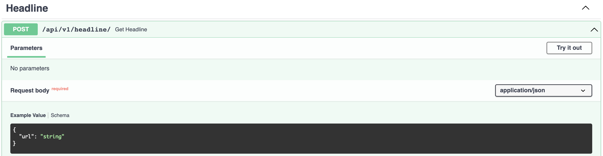
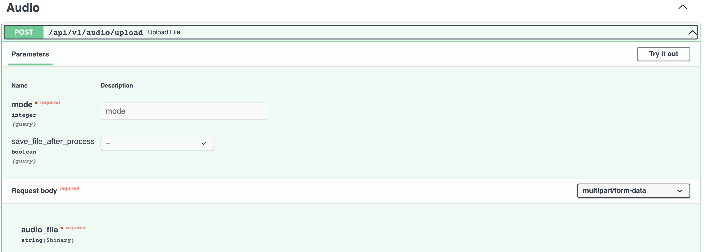

# Backend FastAPI

API for two specific tasks:
 - Get title and content of an article on website www.dantri.com.vn given an url of the article.
 - Get information of sample_rate and duration of a .wav file uploaded. 

## Setup

 - Create an env and install packages, libraries listed in requirements.txt file.

 - Run this command: ``` uvicorn app.main:app --reload ```.

 - Go to ``` http://127.0.0.1:8000/docs ``` to test API in Swagger UI.

## Features



 - Put the url of the article to the ```url``` param.



 - With the mode 1 (process audio with tool (e.g. ```sox```)), you have to specify a bool True/False to choose saving that audio file to local directory or not. If choose False, the audio will be temporarily saved to /tmp directory and removed after being finished.

 - With the mode 2, the audio will be processed with binary architect file. You can not provide the option for the bool param.

 - Upload a .wav file to execute.


 


 

